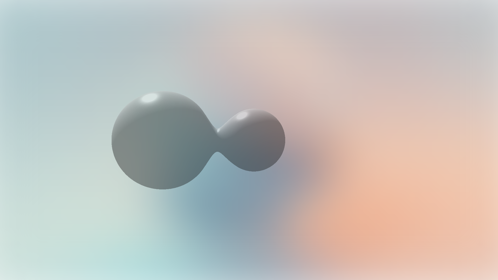

# Raymarching

A dynamic raymarching shader powered by **Three.js** and **GLSL**. Combines soft-blended **SDFs**, real-time lighting, and animated surface distortion driven by time. Features a responsive full-screen canvas, subtle **blurred background**, and interactive **lil-gui** controls for blend, lighting, and color. Optimized with pixel ratio clamping, smooth resizing, and efficient **orthographic rendering** for a clean and modern WebGL experience.

[](https://raymarching-dun.vercel.app/)

---

## ✨ Features

* 🌊 **Raymarched Effect** rendered with soft-blended **Signed Distance Fields (SDFs)** for smooth, organic shapes
* 💡 **Real-Time Lighting** using customizable light color, intensity, and specular highlights
* 🌀 **Animated Distortion** driven by `iTime` for continuous fluid motion and surface warping
* 🎛️ **Interactive Controls** via **lil-gui** to tweak blend, light strength, and color in real time
* 🖼️ **Blurred Background Layer** for visual depth using a full-screen image with soft Gaussian blur
* 📐 **Orthographic Rendering** for accurate 2D-style shading and clean perspective
* 📱 **Responsive Design** with pixel ratio clamping and automatic resizing for all screen sizes
* 🎨 **GLSL Shader Customization** with modular structure for easy extension and experimentation
* 🚀 **Three.js Optimized Setup** using `ShaderMaterial`, efficient uniform updates, and minimal scene overhead

---

## 🧠 How It Works

* Renders a full-screen quad using an **orthographic camera** and a custom `ShaderMaterial`
* Defines a scene using **Signed Distance Functions (SDFs)** for multiple spheres, blended smoothly with `smin()`
* Animates the SDFs in real time using the `iTime` uniform to create fluid, liquid-like motion
* Computes surface normals manually in the shader for accurate lighting and shading
* Applies **Phong-style lighting**, including ambient, diffuse, and specular components with adjustable intensity and color
* Integrates **lil-gui** for live control over blend amount, light intensity, specular strength, and light color
* Displays a full-screen **blurred background image** for depth and contrast behind the shader
* Ensures responsive rendering by clamping device pixel ratio and updating resolution uniforms on resize
* Uses alpha blending and transparent background for seamless integration with other layers or UI

---

## 🛠️ Built With

* [Three.js](https://threejs.org/) – Core 3D library for scene setup, camera, and shader rendering
* [GLSL](https://thebookofshaders.com/) – Custom fragment and vertex shaders for raymarching and lighting
* [TailwindCSS](https://tailwindcss.com/) – Utility-first CSS framework for responsive layout and styling
* [lil-gui](https://lil-gui.georgealways.com/) – Lightweight GUI for live tweaking of shader parameters
* [ShaderMaterial](https://threejs.org/docs/#api/en/materials/ShaderMaterial) – Used for custom raymarching effects via GLSL
* [PlaneGeometry](https://threejs.org/docs/#api/en/geometries/PlaneGeometry) – Full-screen quad for fragment-based rendering
* [OrthographicCamera](https://threejs.org/docs/#api/en/cameras/OrthographicCamera) – For accurate 2D projection with consistent scale across screen sizes

---

## Clone the repo

```bash
git clone https://github.com/its-riki-dev/liquid-raymarching.git

# Install dependencies
npm install

# Start the development server
npm run dev

# Build for production
npm run build

# Preview production build
npm run preview
```

---

## 📄 License

- This project is licensed under the MIT License.
